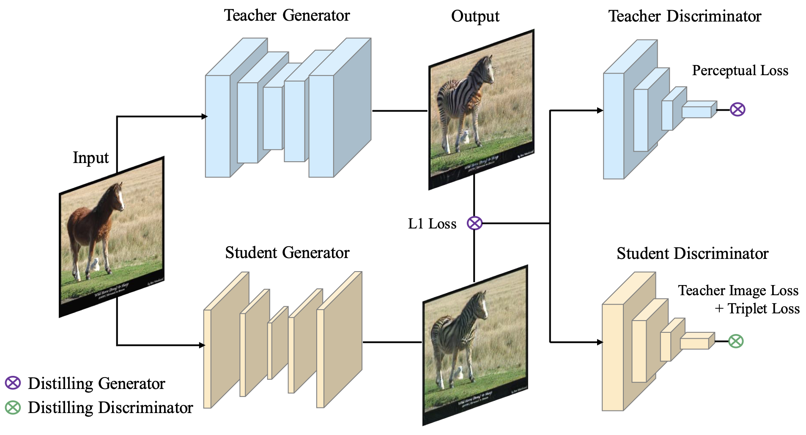
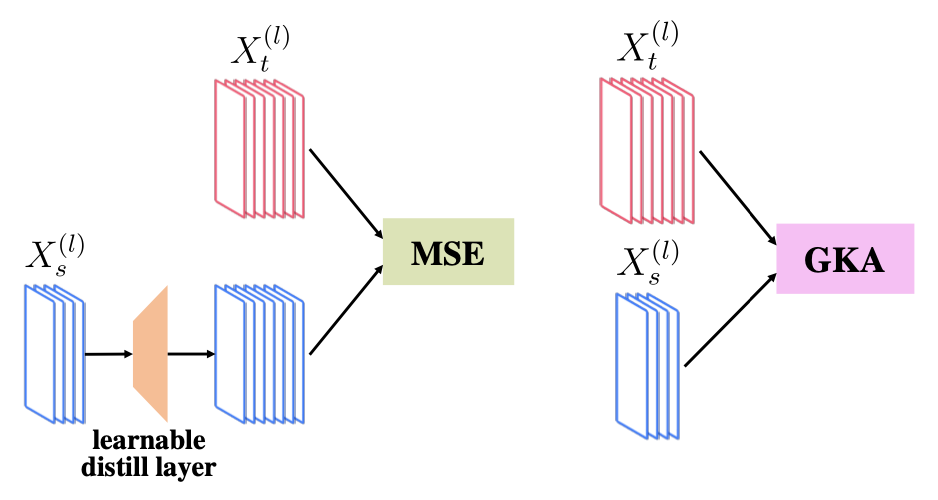
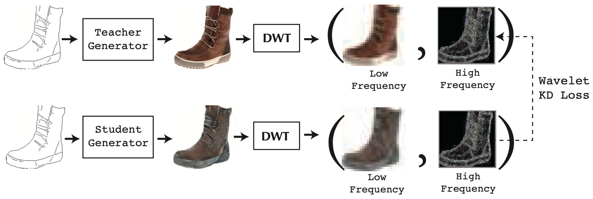
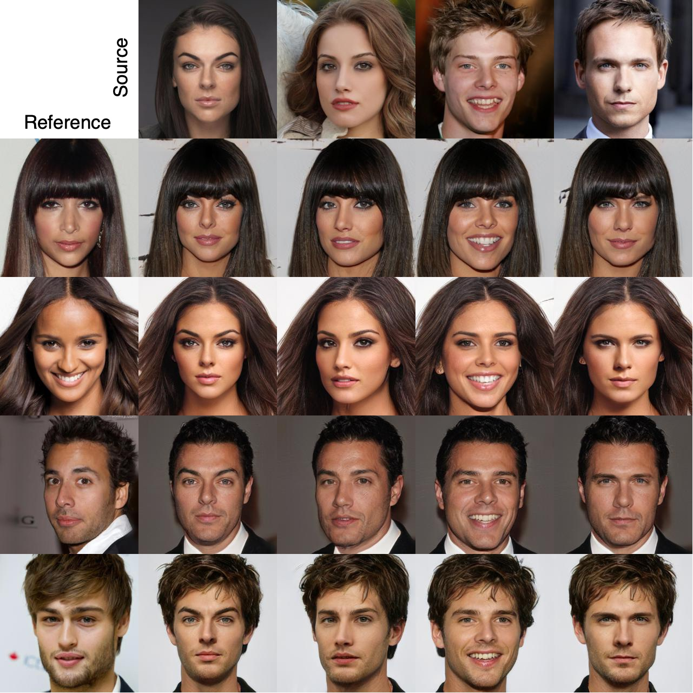
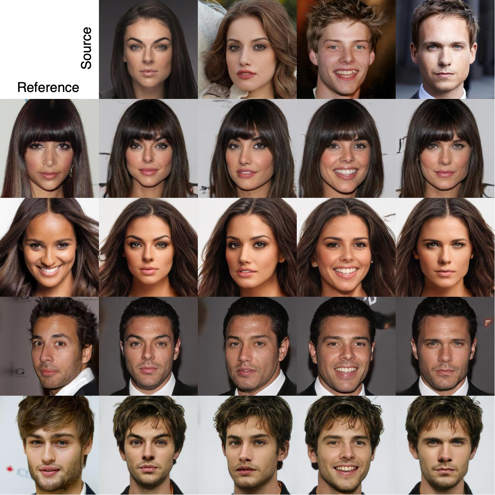

## Knowledge Distillation for GANs

### Overview

This project demonstrates the implementation of a knowledge distillation pipeline for Generative Adversarial Networks (GANs). This project builds upon the official source implementation of StarGAN v2, however his approach is adaptable to various generative models due to its generalized loss functions. The primary aim is to retain the high-quality outputs of larger models while reducing their complexity.

### Background
Knowledge distillation operates on a "teacher-student" paradigm, where a smaller model (the student) learns to mimic a larger pre-trained model (the teacher). Below are key distillation techniques employed in this project:

1. **Pixelwise MSE Loss**: This technique combines Mean Squared Error (MSE) loss between the outputs of the student's generator and the teacher's generator, alongside a classical adversarial loss for the student. The student discriminator can be trained from scratch or utilize a pre-trained version (paper [1]).

2. **Perceptual and Triplet Loss**: The perceptual loss minimizes the differences in intermediate image features from both models, derived from the initial layers of the teacher's discriminator. A triplet loss is also introduced to ensure that the distance between true images and those generated by the teacher is smaller than that to the images generated by the student (paper [2]).


3. **Transfer Features Distillation GKA Loss**: This method emphasizes transferring features by minimizing the L2 difference between layer outputs. It addresses channel discrepancies with a learnable layer and employs Global Kernel Alignment (GKA) to measure output similarity, allowing direct comparisons without additional layers (papers [5],[7],[8]). 


4. **Discrete Wavelet Transformation Loss**: To enhance the detail in student-generated images, this method minimizes differences in high-frequency details, addressing limitations in traditional GANs (paper [10]).


5. **Features-Based Wavelet Loss**: As an extension of previous work, we propose a loss that combines intermediate feature extraction across frequency components with the GKA metric for high-frequency component similarity. By applying Discrete Wavelet Transformation (DWT) to both generated images and intermediate feature maps, we can effectively compare high-frequency components, accommodating differences in channel counts between models.

### Proposed Method

The proposed distillation technique is designed to be agnostic to specific generator architectures, incorporating various prior approaches. It combines multiple penalty functions across different neural network components.


### Installation and Usage

Please follow the installation guidelines and dataset downloading instructions to set up the environment. Implementation of the knowledge distillation pipeline, along with the loss functions, can be found in the `distill_scripts` and `losses` directories.

### Software installation

> [StarGAN v2 - Official PyTorch Implementation](https://github.com/clovaai/stargan-v2)
> 
> Paper: https://arxiv.org/abs/1912.01865<br>

Clone this repository:

```
git clone https://github.com/clovaai/stargan-v2.git
cd stargan-v2/
```

Install the dependencies:
```
conda create -n stargan-v2 python=3.6.7
conda activate stargan-v2
conda install -y pytorch=1.4.0 torchvision=0.5.0 cudatoolkit=10.0 -c pytorch
conda install x264=='1!152.20180717' ffmpeg=4.0.2 -c conda-forge
pip install opencv-python==4.1.2.30 ffmpeg-python==0.2.0 scikit-image==0.16.2
pip install pillow==7.0.0 scipy==1.2.1 tqdm==4.43.0 munch==2.5.0
```

### Datasets and pre-trained networks
Provided scripts to download datasets used in StarGAN v2 and the corresponding pre-trained networks. The datasets and network checkpoints will be downloaded and stored in the `data` and `expr/checkpoints` directories, respectively.

<b>CelebA-HQ.</b> To download the [CelebA-HQ](https://drive.google.com/drive/folders/0B4qLcYyJmiz0TXY1NG02bzZVRGs) dataset and the pre-trained network, run the following commands:
```
bash download.sh celeba-hq-dataset
bash download.sh pretrained-network-celeba-hq
bash download.sh wing
```
<b>AFHQ.</b> To download the [AFHQ](https://github.com/clovaai/stargan-v2/blob/master/README.md#animal-faces-hq-dataset-afhq) dataset and the pre-trained network, run the following commands:
```
bash download.sh afhq-dataset
bash download.sh pretrained-network-afhq
```

### Evaluation metrics
To evaluate StarGAN v2 using [Fr&eacute;chet Inception Distance (FID)](https://arxiv.org/abs/1706.08500) and [Learned Perceptual Image Patch Similarity (LPIPS)](https://arxiv.org/abs/1801.03924), run the following commands:

```
# celeba-hq
python main.py --mode eval --num_domains 2 --w_hpf 1 \
               --resume_iter 100000 \
               --train_img_dir data/celeba_hq/train \
               --val_img_dir data/celeba_hq/val \
               --checkpoint_dir expr/checkpoints/celeba_hq \
               --eval_dir expr/eval/celeba_hq

# afhq
python main.py --mode eval --num_domains 3 --w_hpf 0 \
               --resume_iter 100000 \
               --train_img_dir data/afhq/train \
               --val_img_dir data/afhq/val \
               --checkpoint_dir expr/checkpoints/afhq \
               --eval_dir expr/eval/afhq
```

### Training networks
To train StarGAN v2 from scratch, run the following commands. Generated images and network checkpoints will be stored in the `expr/samples` and `expr/checkpoints` directories, respectively. Training takes about three days on a single Tesla V100 GPU. Please see [here](https://github.com/clovaai/stargan-v2/blob/master/main.py#L86-L179) for training arguments and a description of them. 

```
# celeba-hq
python main.py --mode train --num_domains 2 --w_hpf 1 \
               --lambda_reg 1 --lambda_sty 1 --lambda_ds 1 --lambda_cyc 1 \
               --train_img_dir data/celeba_hq/train \
               --val_img_dir data/celeba_hq/val

# afhq
python main.py --mode train --num_domains 3 --w_hpf 0 \
               --lambda_reg 1 --lambda_sty 1 --lambda_ds 2 --lambda_cyc 1 \
               --train_img_dir data/afhq/train \
               --val_img_dir data/afhq/val
```

### Generated Examples
To compress the model, we restrict the maximum number of channels in the convolution layers and the maximum number of hidden nodes in the linear layers for all the networks in StarGAN v2 pipeline.

| Teacher                                                              | Student x22 less                                                                 | 
|----------------------------------------------------------------------|----------------------------------------------------------------------------------|
|  |  |  

### References

[1] Angeline Aguinaldo, Ping-Yeh Chiang, Alexander Gain, Ameya Patil,
Kolten Pearson, and Soheil Feizi. Compressing GANs using knowledge
distillation.

[2] Hanting Chen, Yunhe Wang, Han Shu, Changyuan Wen, Chunjing Xu,
Boxin Shi, Chao Xu, and Chang Xu. Distilling portable generative
adversarial networks for image translation.

[5] Qing Jin, Jian Ren, Oliver J. Woodford, Jiazhuo Wang, Geng Yuan,
YanzhiWang, and Sergey Tulyakov. Teachers do more than teach: Compressing
image-to-image models.

[7] Muyang Li, Ji Lin, Yaoyao Ding, Zhijian Liu, Jun-Yan Zhu, and Song
Han. GAN compression: Efficient architectures for interactive conditional
GANs.

[8] Huan Wang, Yijun Li, Yuehai Wang, Haoji Hu, and Ming-Hsuan Yang.
Collaborative distillation for ultra-resolution universal style transfer.

[10] Linfeng Zhang, Xin Chen, Xiaobing Tu, Pengfei Wan, Ning Xu, and
Kaisheng Ma. Wavelet knowledge distillation: Towards efficient imageto-
image translation.